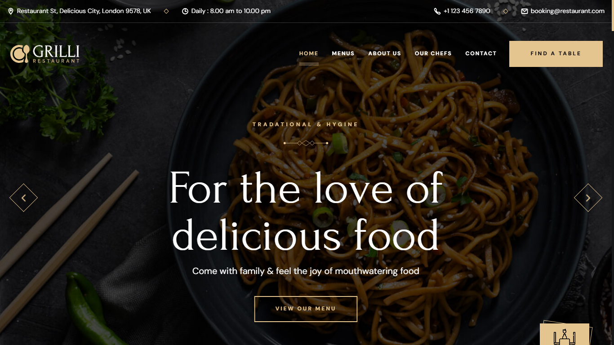

# Foodie 🍽️

Welcome to the Foodie Website repository! This repository hosts the codebase for the Foodie website, where food enthusiasts can explore recipes, cooking tips, and culinary inspirations.

## Features 🌟

- **Recipe Collection**: Browse through a diverse collection of recipes for various cuisines and dietary preferences.
- **Cooking Tips**: Discover useful tips and techniques to enhance your culinary skills.
- **Ingredient Insights**: Learn about different ingredients, their uses, and benefits.
- **Community Engagement**: Engage with a community of food lovers, share your recipes, and participate in discussions.

## Technologies Used 🛠️

- **HTML5**: Structure of web pages.
- **CSS3**: Styling and layout.
- **JavaScript**: Dynamic elements and interactions.
- **Bootstrap**: Front-end component library for responsive design.
- **GitHub Pages**: Hosting platform for static websites.

## Getting Started 🚀

To view the Foodie website, simply navigate to [Live Preview](https://krypto-etox.github.io/foodie/) in your web browser.

### Local Development 🖥️

If you want to contribute or modify the website locally:

1. Clone this repository:
   ```bash
   git clone https://github.com/krypto-etox/foodie.git
   ```

2. Open the project directory:
   ```bash
   cd foodie
   ```

3. Modify/add files as necessary.

4. Open `index.html` in your browser to view changes locally.

## Contributing 🤝

Contributions are welcome! If you have suggestions for new features, improvements, or find any issues, please create a GitHub issue or directly submit a pull request.

## License 📄

The content of this repository is licensed under the MIT License. See the [LICENSE](LICENSE) file for more details.

## Screenshot 📸



---
